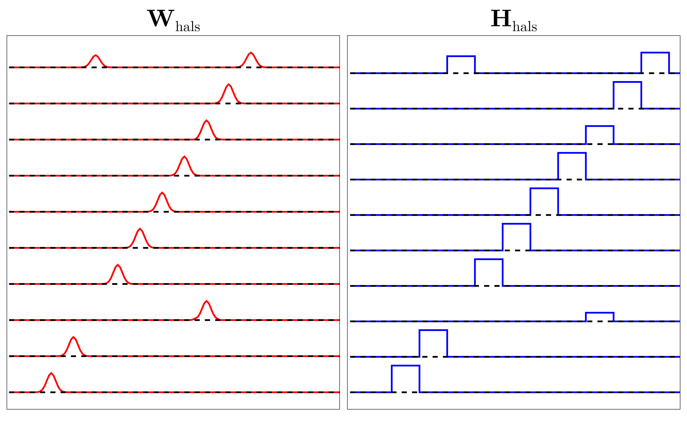

# GsvdInitialization

[](https://github.com/HolyLab/GsvdInitialization.jl/actions/workflows/CI.yml)
[](https://codecov.io/gh/HolyLab/GsvdInitialization.jl)

This package implements the technique in the paper [GSVD-NMF: Recovering Missing Features in
Non-negative Matrix Factorization](https://arxiv.org/abs/2408.08260).
It is used to recover Non-negative matrix factorization(NMF) components from an initial lower-rank factorization by exploiting the generalized singular value decomposition (GSVD) between existing NMF results and the SVD of X.
This method allows the incremental expansion of the number of components, which can be convenient and effective for interactive analysis of large-scale data.

See also [NMFMerge](https://github.com/HolyLab/NMFMerge.jl) for the converse operation. Together, the two result in a substantial improvement in the quality and consistency of NMF factorization.

---------------------------

Demo:

To run this demo, NMF.jl and LinearAlgebra.jl are also required.

Install and load packages (type `]` at the `julia>` prompt to enter `pkg>` mode):
```julia
pkg> add GsvdInitialization;
julia> using GsvdInitialization, NMF, LinearAlgebra;
```

Generating grouth truth with 10 features.

```julia
julia> include("demo/generate_ground_truth.jl")
julia> W_GT, H_GT = generate_ground_truth();
julia> X = W_GT*H_GT;
```


Running standard NMF(HALS) using NNDSVD as initialization on X. Here, we're taking a couple of precautions to try to ensure the best possible result from NMF:
- we disable premature convergence by setting `maxiter` to something that is practically infinite
- we use the full `svd`, rather than `rsvd`, for initializing NNDSVD, as `svd` gives higher-quality results than `rsvd`
Despite these precautions, we'll see that the NMF result leaves much to be desired:

```julia
julia> result_hals = nnmf(X, 10; init=:nndsvd, alg = :cd, tol = 1e-4, maxiter=10^12, initdata = svd(X));
julia> sum(abs2, X-result_hals.W*result_hals.H)/sum(abs2, X)
0.0999994991270576
```
The result is given by



This factorization is not perfect as two components are the same and two features share one component.
Then, running GSVD-NMF on X (also using NNSVD as initialization) and computing the new reconstruction error:

```julia
Wgsvd, Hgsvd = gsvdnmf(X, 9=>10; alg = :cd, tol_final = 1e-4, tol_intermediate = 1e-2, maxiter = 10^12);
julia> sum(abs2, X-Wgsvd*Hgsvd)/sum(abs2, X)
1.2322603074132593e-10
```
An imperfect factorization from `nnmf` alone was augmented by `gsvdnmf` to a perfect factorization.
Here are the new components:


---------------------------

## Functions

W, H = **gsvdnmf**(X::AbstractMatrix, ncomponents::Pair{Int,Int}; 
                   tol_final=1e-4, 
                   tol_intermediate=1e-4, 
                   kwargs...)

Perform "GSVD-NMF" on the data matrix `X`.

Arguments:

- `X`: non-negative data matrix

- `ncomponents`: in the form of `n1 => n2`, augments from `n1` components to `n2`components,
  where `n1` is the number of components for initial NMF (under-complete NMF), and `n2` is the number of
  components for final NMF.

Alternatively, `ncomponents` can be an integer denoting the number of components for final NMF.
In this case, `gsvdnmf` defaults to augment components on initial NMF solution by 1.

Keyword arguments:

- `tol_final`: The tolerence of final NMF, default:`10^{-4}`

- `tol_intermediate`: The tolerence of initial NMF (under-complete NMF), default: tol_final

Other keyword arguments are passed to `NMF.nnmf`.

-----

W, H = **gsvdnmf**(X::AbstractMatrix, W::AbstractMatrix, H::AbstractMatrix, f;
                   n2 = size(first(f), 2),
                   tol_nmf=1e-4,
                   kwargs...)

Augment `W` and `H` to have `n2` components, subsequently polished by NMF.

Arguments:

- `X`: non-negative data matrix

- `W` and `H`: initial NMF factorization

- `n2`: the number of components in augmented factorization

- `f`: SVD (or Truncated SVD) of `X`

Keyword arguments:

- `tol_nmf`: the tolerance of  NMF polishing step, default: 1e-4

Other keyword arguments are passed to `NMF.nnmf`.

-----

Wadd, Hadd, S = **gsvdrecover**(X, W0, H0, kadd, f)

Augment components for `W` and `H` without polishing by NMF.

Outputs:

`Wadd`: augmented NMF solution

`Hadd`: augmented NMF solution

`S`: generalized singular values for the `kadd` augmented components

Arguments:

`X`: non-nagetive 2D data matrix

`W0`: NMF solution

`H0`: NMF solution

`kadd`: number of new components

`f`: SVD (or Truncated SVD) of `X`

-----

## Citation

Thanks for citing this work! See the "Cite this repository" link in the "About" bar for format options.
